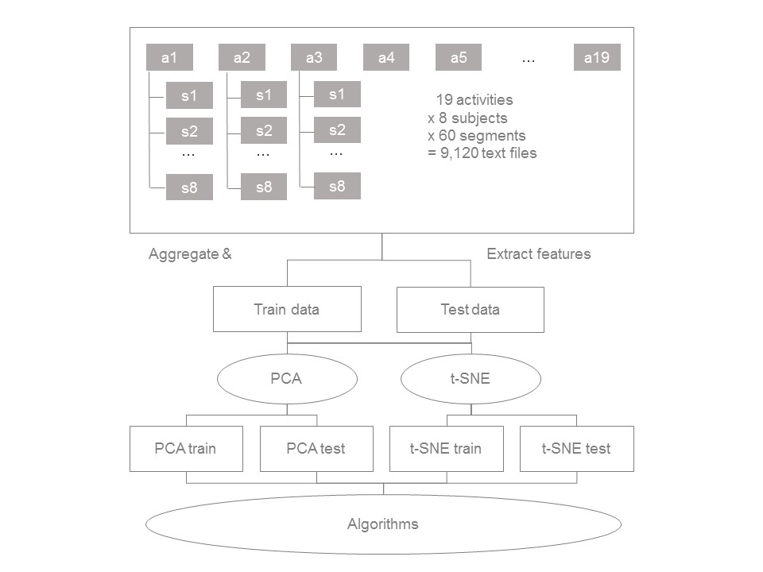
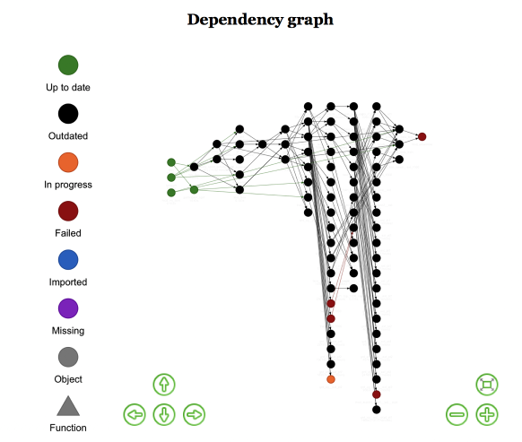

```{r}
data_dir <- function(...) root("caches", ...)
dataset <- readr::read_rds(data_dir("9749ec6372b1eb3e.rds"))

```


```{r setup, include=FALSE}
knitr::opts_chunk$set(echo = FALSE, warning = FALSE, message = FALSE, cache = FALSE)
```

```{r, include=FALSE}
# Create functions which pre-append fully-expanded file paths to relative paths
library(rprojroot)
root <- is_rstudio_project$make_fix_file()
data_dir <- function(...) root("data", ...)
src_dir <- function(...) root("src", ...)
import_code <- function(r_file) source(src_dir(r_file))
```

```{r package-load, include=FALSE, eval=TRUE}
import_code("01-packages.R")
```

```{r activities, include=FALSE}
activity_descriptions <- tribble(
  ~Activity, ~Abbreviation,
  "sitting", "a01",
  "standing", "a02",
  "lying on back", "a03",
  "lying on right side", "a04",
  "ascending stairs", "a05",
  "descending stairs", "a06",
  "still in an elevator", "a07",
  "moving in an elevator", "a08",
  "walking in a parking lot", "a09",
  "walking on a flat treadmill", "a10",
  "walking on an inclined treadmill", "a11",
  "running on a treadmill", "a12",
  "exercising on a stepper", "a13",
  "exercising on a cross trainer", "a14",
  "cycling horizontally", "a15",
  "cycling vertically", "a16",
  "rowing", "a17",
  "jumping", "a18",
  "playing basketball", "a19"
)
```

\begin{titlepage}
	\newcommand{\HRule}{\rule{\linewidth}{0.5mm}} % Defines a new command for horizontal lines, change thickness here
	
	\center % Centre everything on the page
	
	%------------------------------------------------
	%	Headings
	%------------------------------------------------
	
	%\textsc{\LARGE Institution Name}\\[1.5cm] % Main heading such as the name of your university/college
	
	\textsc{\Large MA429 Final Project}\\[0.5cm] % Major heading such as course name
	
	%\textsc{\large Minor Heading}\\[0.5cm] % Minor heading such as course title
	
	%------------------------------------------------
	%	Title
	%------------------------------------------------
	
	\HRule\\[0.6cm]
	
	{\huge\bfseries Daily \& Sports Activities}\\[0.15cm]
	{\LARGE\bfseries Predicting activity types from sensor data}\\[0.4cm]
	
	\HRule\\[1.5cm]
	
	%------------------------------------------------
	%	Graphic
	%------------------------------------------------
	
	
	\includegraphics[width=1\linewidth,height=0.6\textheight]{./sports}
	\vfill\vfill
	
	%------------------------------------------------
	%	Author(s)
	%------------------------------------------------
	
	{\large\textit{Candidates}}\\[0.2cm]
	\textsc{81516}, \textsc{84942} and \textsc{87512}
	
	%------------------------------------------------
	%	Date
	%------------------------------------------------
	
	\vfill
	
	{\large\today} % Date, change the \today to a set date if you want to be precise
	 
	%----------------------------------------------------------------------------------------
	
\end{titlepage}

\pagenumbering{gobble} 

\newpage
\tableofcontents
\newpage
\pagenumbering{arabic} 

# Executive Summary

In a variety of ways, society could greatly benefit from accurate activity profiling systems that use sensor data to classify the movement a person is performing. Gurley et al (1996) reported that 27 out of 1000 elderly people per year are found helpless or dead in their homes, mostly resulting from falls that could not be detected remotely. An activity profiling system detecting such falls could alleviate harms caused by these falls through quicker medication and ultimately save lives and costs to the healthcare system. Similarly, accurate profiling systems could provide valuable feedback to people in how their movements differ from a healthy or recommended execution of an activity such as running or walking to help in understanding in the link between physical movement and diseases.

With the introduction of granular sensors, the technical prerequisites are readily available to collect vast data from body-worn sensors. While the detection of falls has been an area of intensive research [@preece2009activity], the classification of activity types in an uncontrolled setting has only recently been more thoroughly explored. One of the pre-eminent datasets in this regard is publicly available in the UCI database as the Daily & Sports Activity datasets and was collected by @altun2010human. For the experiment, 8 subjects performed 19 activities such as running, walking, playing basketball or jumping with data being collected from multiple body-worn sensors. In the literature published on this dataset, researchers were able to achieve accuracy rates in predicting activity type from sensor data up to 99.2% using machine learning algorithms.

This paper aims to replicate and improve the accuracy of predicting activities using different dimensionality reduction approaches and a range of supervised learning algorithms, most of which have not been applied to the dataset yet. Overall, we found consistently high performance of our algorithms of around 99% accuracy on the test dataset. In our best performing model XGBoost and for the model ensemble, we achieved a test accuracy of 99.3%, which thereby even slightly outperforms the best models from prior research. However, we note that our models in line with most prior research are optimised to detect activities from a person, for which training data are available. Testing our models on subjects not included in the training process lead to significantly less accuracy, as prior research also found.

# Introduction

The goal of this project is to apply machine learning algorithms to a dataset of our choice. We selected the UCI Daily and Sport Activities dataset, which was retrieved from the Machine Learning Repository and consists of sensor data collected from subjects performing 19 daily and sports activities such as running or jumping. Prior research achieved up to 99.2% accuracy in using this dataset to predict the activity type.

The goal of this paper is two-fold. Firstly, we aim to replicate the best-performing models from prior research and secondly, we aim to use additional preprocessing, dimensionality reduction and machine learning algorithms to explore different avenues for predicting activity type and improve upon the current state-of-the-art.

Despite not being explicitly manifest in our paper, one of the foremost goals of our project was to push the envelope with state-of-the-art data mining practices. For this reason, the structure of the remainder of the report adheres to the Cross Industry Standard Process for Data Mining to clearly illustrate the workflow we took. Additionally, our models were run on the LSE high-performance supercomputer, *Fabian*, using an R API to the H2O machine learning backend^[Part of our decision to use this software was influenced by the fact that the authors of @tibshirani2013introduction are in fact the scientific advisors to H2O.ai, the company behind the platform.] [@Packageh2o]. The ability to leverage this purpose-built Java platform on a distributed cluster with 16 nodes each up to 48 CPUs and 1TB of RAM significantly enhanced the computational aspect of our project over running native R code on a personal laptop. Our project also heavily relied on the brand-new ROpenSci package `drake` to manage the reproducibility of the project at scale [@drake].

This paper proceeds in the following steps. First, it will summarise the literature on using sensor data to predict activity types. Then, it will introduce the UCI Daily and Sports Activities Dataset and describe the transformations from the raw sensor data to condensed features performed in prior literature whilst also proposing additional time-series features. We then derive a combined dataset containing both the features from prior research and our own. Secondly, we will perform dimensionality reduction on the extensive feature set. Prior research used principal component analysis, which we will replicate in addition to will applying a dimensionality reduction method called t-distributed Stochastic Neighbour Embedding. The three derived datasets will act as the input for our algorithms in the third step. In this third step, we will apply a variety of machine learning algorithms, namely logistic regression, random forest, XGBoost, kNN and Artificial Neural Network. Some of these algorithms have been employed in prior research such as the Neural Network, while others are applied for the first time to the dataset. Accuracy, weighted misclassifcation error based on the cost matrix, a newly defined misclassification density and the running time of the algorithms will be used as performance metrics, against which these models will be evaluated both on the training and test data. Fourth, we will describe the pros and cons of each model and dataset choice, limitations, interesting insights and practical implications and summarise our work.

# Data Understanding

Prior to commencing any form of modelling, it is imperative that one properly understands the nuances of the data they're working with from the perspective of high-level domain expertise right down to distributions, missingness and anomalies in the dataset itself. We began by conducting a general assessment of prior work in the areas of time series analysis methods and activity profiling systems followed by learning about the literature to-date with the Daily and Sports Activities dataset before ultimately visualising and profiling the dataset for ourselves.

## Literature on Activity Profiling Systems

Extensive research has been conducted on classifying activities based on body-worn sensors with such classifications having high societal relevance. The preeminent goal of research thus far has been to identify falls, as elderly people today suffer serious physical harm from not being found for some time after a fall occurs and body-worn sensors that can accurately detect a fall and request help could alleviate such harms. In the same way, people with mental and physical disabilities could greatly benefit from such sensors and there is also the possibility of aiding athletes in performing sports exercises. Until today, cameras are the most widely-used device to provide feedback to individuals on their performance of specific tasks however properly configured sensors could provide additional feedback points and help individuals to improve on sports by comparing their movements against world-class performers. Lastly, records on individual activities could help in understanding the link between physical movement and diseases.

Prior to the introduction of the Daily and Sports Activities dataset, researchers achieved 85-97% accuracy in classifying activities. It is important to note that such accuracy scores were achieved in a controlled environment, where the style of performing a specific activity was precisely prescribed. In this research, the process of classifying activities based on sensor data is divided into a) feature generation/selection and b) the application of classification algorithms [@preece2009activity].

For feature generation, one must first define how to split sensor data into time windows or segments. The first possibility is to use sliding windows, where each window has a fixed length and there are no inter-window gaps and such sliding windows were used by researchers on the Daily & Sport Activities dataset. The second type are event-defined windows, where data points are the time windows, where an event happens (such as a fall), while the third type are activity-defined windows, which are similar to event-defined windows and describe points in time, when an activity changes. These time windows are subsequently used to generate the features. Three common ways of summarizing data in a given time window are used:

- **Heuristic features**: Based on intuitively known attributes of an activity such as velocity or sound. For a fall, it could be known to the researcher that it consists of a period of acceleration with a following rapid deceleration. Testing for those specific events would allow the researcher to find activities with commonly known features. That said, this approach is limited, as domain-specific knowledge is required for each activity.

- **Time-domain features**: Summary statistics of the time segments such as mean, variance, skewness, minimum, maximum. Such time-domain features do not require any prior knowledge of activities and are the ones used by @altun2010human^[For brevity in this chapter we will refer to just the first of three papers; @altun2010human, @altun2010comparative and @barshan2013recognizing however all of them perform the same preprocessing steps.]. Additional time-domain features used in other research, but not yet applied to the dataset at hand are the spectral entropy of the time-series [@Jung2006], and the number of crossing points, level-shift and variance change^[These methods are explained in detail in the Feature Extraction section.] [@hyndman2016detection]. @fahrenberg1997assessment also calculated separate means for the low and high frequency components.

- **Frequency-domain features**: Decompose the data from time windows into frequency components via fast Fourier transform. Fourier transformation is based on the law that all waveforms can be decomposed into sinusoids of different lengths and frequencies and in the process of the transformation, these fundamental sinusoids are extracted from the original wave. @altun2010human extract the maximum 5 Fourier peaks for each segment including the corresponding frequency values.

- **Wavelet analysis**: Augmented Fourier transformation with temporal information. A number of studies have applied wavelet analysis to activity classification. However, it has been shown that is not suited in environments where there are short time windows with little frequency changes [@preece2009comparison].

Once the sensor data is summerised with the above methods, certain features out of this smaller set are selected either manually or using dimensionality reduction methods. What remains is a dataset with rows equivalent to the number of segments and columns equivalent to the extracted dimensions. Subsequently, a number of classification algorithms are applied to those datasets to predict activity type. Table \ref{tab:prediction-before-dsad} summarises various algorithms applied to predict activities prior to the Daily Sports & Activities research using a dataset of similar nature. Some algorithms were applied with no consistent or reliable results obtained in which case they are marked as n/a.

```{r priorlit, include=TRUE, eval=TRUE}

summary <- tribble(
    ~"Classification Algorithm", ~Accuracy,
    "Markov chains", "47-95%",
    "Artificial neural network", "82-93%",
    "Naive Bayes & Gaussian Mixture Models", "64-91%",
    "k-nearest neighbour", "50-90%",
    "Decision tree", "57-84%",
    "Hierarchical methods", "71-83%",
    "Support vector machines", "63%",
    "Threshold-based classification", "n/a",
    "Fuzzy logic", "n/a",
    "Combined voting of different classification methods", "n/a"
)

kable(summary, caption = "\\label{tab:prediction-before-dsad}Accuracy for activity prediction prior to Daily & Sports Activity Dataset [@preece2009activity]")
```

Interspersed with the supervised algorithms, a number of unsupervised methods are commonly applied to detect activities such as k-means clustering or self-organizing feature maps [@preece2009activity]. It is important to note that these studies applied supervised and unsupervised learning algorithms to a variety of datasets which differed in the number and variation of activities or number of subjects so significant differences between studies are to be expected. For studies that applied more than one algorithm to a specific dataset, no significant differences could be established between classifiers suggesting that in general no algorithm performs better than others in predicting activities.

## UCI Daily and Sports Activities Dataset

As a means to produce a more robust dataset for activity recognition, Barshan from Bilkent University in Ankara, Turkey, recorded sensor data for Daily and Sports activities and applied several algorithms for activity classification over three papers; @altun2010human, @altun2010comparative, @barshan2013recognizing.

The Daily and Sports Activities dataset consists of motion sensor data recorded for 8 subjects performing 19 activities over 5-minute time intervals. The activities were sitting (A1), standing (A2), lying on the back and on the right side (A3 and A4), ascending and descending stairs (A5 and A6), standing in an elevator still (A7) and moving around in an elevator (A8), walking in a parking lot (A9), walking on a treadmill with 4 km/h speed (in flat in 15 degree inclined position) (A10 and A11), running on a treadmill with a speed of 8 km/h (A12), exercising on a stepper and cross trainer (A13 and A14, cycling on an exercise bike in horizontal and vertical positions (A15 and A16), rowing (A17), jumping (A18), and playing basketball (A19). The 8 subjects divide into 4 female and male participants between the ages of 20-30. In contrast to prior research, they were given the freedom to perform the activities in their own style and speed. Each participant conducted all 19 activities at Bilkent University Sports Hall and a flat outdoor area on campus. A detailed account of the experiment setting can be found in @altun2010human, @altun2010comparative and @barshan2013recognizing.

Each subject wore 5 inertial and magnetic sensor units; on their chest, arms (right and left) and legs (right and left). Each sensor unit consisted of a gyroscope, accelerometer and magnetometer that measured movement along three-dimensional axes. The gyroscope is used for measuring angular velocity, the accelerometer measures the acceleration of the object and the magnetometer captures the strength of the Earth's magnetic field.

For a subject jumping, the accelerometer should show sharp increases in vertical acceleration at the beginning of the jump. In the air, there will be a deceleration to the point of reversal (where the highest point is reached) and acceleration towards the grounds starts. This acceleration is sharply cut off, when the subject reaches the ground. The gyroscope will show minimal changes, since no angular velocity in any direction is expected. The magnetometer might record minimal changes in the earth magnetic field depending on the height of the subject in the air. A magnetometer would show stronger changes for subjects standing in the moving elevator for example. When running on the treadmill, the accelerometers on the legs show vertical acceleration when the leg is moved up and forward acceleration into the direction of running, while the accelerometers on the torso will likely not show any significant signals. The gyroscope will show velocity in the direction of running, while the magnetometer will be close to 0, as the subject stays in one physical location.

For each sensor unit, there were 3 axes $\times$ 3 sensor types = 9 measurements collected at 25 Hz with 9 measurements $\times$ 5 positions = 45 datapoints at each point in time. The 5-minute time interval that each subject performed each activity was subdivided into 60 5-second segments. This gives 25 Hz $\times$ 5 seconds = 125 points in time that the 45 datapoints are collected resulting in 5,625 datapoints for each segment. There are 60 segments $\times$ 8 subjects = 480 total segments available for each of the 19 activities, resulting in 9,120 segments. Consequently, there are 9,120 $\times$ 5,625 = 51.3m individual datapoints. Given the size of the dataset, preprocessing and dimensionality reduction play an important role in ultimately classifying sensor units according to activity. 

## Literature on UCI Daily and Sports Activities Dataset

The research goal was two-fold. First, it aimed to identify the best classifier to predict the activity type from the sensor data. Here, the best classifier is defined as the one with the highest accuracy (>95%), while having low computational complexity to allow for close to real-time processing and classification of sensor data. Second, the goal was to determine the most informative sensor type and sensor configuration. 

As described above, the total dataset consists of 9,120 segments with 5,625 measurements per segment or 51.3m datapoints in total. The latter is made up of 125 time intervals $\times$ 5 sensors $\times$ 9 points per sensor. The overall process closely resembles the one described in the literature review above in first selecting features and second applying supervised learning algorithms on the reduced dataset to predict activity type.

For feature selection, Barshan calculated time-domain features for the 125 time intervals in the first step. In this way, she reduced the 125 time intervals to 26 summary statistics (minimum, maximum, mean, skewness, kurtosis, maximum 5 Fourier peaks and corresponding 5 Fourier values and 11 autocorrelation samples)^[Fourier transformation was explained at a high-level earlier and the autocorrelation of a time-series data measures the likeness of the series against itself with some lag parameter and is often used to detect repeating patterns in signals.]. Through these time-domain features, the dataset is reduced to 9,120 segments (rows) and $26 \times 45 =$ 1,170 features (columns). In a second step, dimensionality reduction via principal component analysis is applied to the features to determine the most meaningful features. The top 30 principal components are retained.

On this reduced dataset, Barshan applies several supervised learning algorithms. Since the highest accuracy is achieved in @barshan2013recognizing, \ref{tab:barshan2013-algo} summarises the applied algorithms and the achieved accuracy.

```{r barshanyueksek, include=TRUE}

outline = data.frame(
  Algorithm = c("Artificial Neural Network", "Support Vector Machines", "Gaussian Mixture Models", "Bayesian decision-making"),
  Accuracy = c("99.2%", "99.2%", "99.1%", "93.7%")
)

kable(outline, caption = "\\label{tab:barshan2013-algo}Algorithms and 10-fold Cross-Validation Accuracy [@barshan2013recognizing]") 
```

Given the low computational complexity, the Gaussian mixture model might be considered preferable however the highest accuracy models were found to be the Neural Network and SVM [@barshan2013recognizing].

## Exploratory Analysis

The first plan for coming to grips with the dataset is to visualise a few of the time-series.
We chose one participant (p01) and examined the difference between the sensor readings of a 20 second sample from their
total 5min performance for four activities as seen in Figure \ref{fig:ra-acc-plot}.

```{r, include=TRUE}
names(activity_descriptions) <- c("activity_desc", "activity")
ra_acc_plot <-
  daily_sport_activity_data %>%
  as_tibble() %>%
  left_join(activity_descriptions) %>%
  filter(participant == "p1" & # participant 1
           activity_desc %in% c( # select activities
     "walking in a parking lot"
    ,"rowing"
    ,"lying on back"
    ,"moving in an elevator"
    )) %>%
  select(activity_desc, RA_xacc, RA_yacc, RA_zacc) %>% # RA acc sensors only
  group_by(activity_desc) %>%
  mutate(x = row_number()) %>%
  ungroup() %>%
  filter(x <= 1000 & x >= 500) %>%
  tidyr::gather("Sensor", "value", -c(activity_desc, x)) %>%
ggplot(aes(x = x, y = value, colour = Sensor)) +
  facet_wrap(~activity_desc, ncol = 4) +
  geom_line(size = 0.3) +
  scale_y_continuous(minor_breaks = NULL) +
  scale_x_continuous(breaks=c(500, 750, 1000), minor_breaks = NULL) +
  xlab("Measurement No.") + ylab("Sensor Reading") +
  theme_linedraw() + theme(panel.spacing = unit(1, "lines"), panel.grid.major = element_line(colour = "gray85"))
```

```{r ra-acc-plot, fig.height=3, fig.width=8, fig.align='center', fig.cap="\\label{fig:ra-acc-plot}Sample of right arm tri-axial acceleration for four different activities", include=TRUE}
plot(ra_acc_plot)
```

From just the acceleration readings of the right arm (3 of 45 sensor readings), one can already discern quite clearly
between several of the activities.
Lying down has virtually no fluctuation other than a constant gravitational pull in the Z axis. Rowing and walking both exhibit
very regular periodicity due to the rhythmic nature of the activities. The amplitude of the rowing activity is greater due to
the more pronounced changes in direction from moving back and forth on the slider suddenly and the walking signal is more subtle
as it is only picking up a slight regular swinging of the wrist by the side of Participant 1's body. The moving in an elevator
sensor readings are highly erratic and show virtually no regular pattern or cyclicity as expected from the other activities.

To confirm our understanding of the accelerometer measurements we can calculate the L2 norm across the three axes for a handful
of randomly chosen sensor measurements:

```{r, include=TRUE}
daily_sport_activity_data %>%
  as_tibble() %>%
  sample_n(10) %>%
  select(activity, RA_xacc, RA_yacc, RA_zacc) %>%
  group_by_all() %>%
  summarise_all(mean) %>%
  mutate("L2 Norm" = norm(c(RA_xacc, RA_yacc, RA_zacc), "2")) %>%
  rename(Activity = activity) %>%
  kable(caption = "Random sample of 10 right arm acceleration measurements with the L2 norm", digits = 3)
```

At the precise measurement level, we can see that the magnitude of very few measurements actually align with 1G and there are clearly some anomalous readings depending
on the activity. We decided not to treat these "outliers" as they are likely just a product of the error in the accelerometer.
In any case, any erratic behaviour in the readings that is the result of an activity itself will surely assist its classification.

<!-- Manually insert new page to make the report flow better -->
\newpage

In replicating the feature transformations of @altun2010human we examined the correlogram of two activities to better understand the ACF transformation being applied.

```{r, include=TRUE}
acf_plot <- function(activity, main) {
  daily_sport_activity_data %>%
    as_tibble() %>%
    left_join(activity_descriptions) %>%
    select(activity_desc, participant, RA_xacc) %>%
    group_by(activity_desc, participant) %>%
    mutate(x = row_number()) %>%
    filter(activity_desc == activity, participant == "p1") %>%
    ungroup() %>%
    select(RA_xacc) %>%
    acf(main = main)
}
```

```{r acf-plot, out.width=".49\\linewidth", fig.subcap=c('Moving in an Elevator', 'Jumping'), fig.align='center', fig.cap="\\label{fig:acf-plot}Autocorrelation of the right arm $x$-axis accelerometer for two activities (Participant 1)", include=TRUE}
acf_plot("moving in an elevator", main = " ")
acf_plot("jumping", main = " ")
```

Figure \ref{fig:acf-plot} shows how the autocorrelation function discerns between sinusoidal series and those displaying no pattern. The "Jumping" series is clearly sinusoidal as there is a pronounced correlation with itself at regular intervals and a slight negative correlation when the signal is half a period out from itself. In contrast, the "Moving in an Elevator" plot exhibits characteristics of white noise; far from the autoregressive properties of the "Jumping" correlogram. It is the regularity of these maximal peaks that is captured as part of the ACF variable transformation; an irregular series will have its peaks sequentially
from 0 and a regular series will have its peaks spaced evenly according to its period.

```{r gyro-plot, fig.cap="\\label{fig:gyro-plot}Mean Gyroscope measurement by sensor position and activity", include=FALSE}
heat_map_data <-
  daily_sport_activity_data %>%
  as_tibble() %>%
  select(-c(file_num, participant, segment)) %>%
  group_by(activity) %>%
  summarise_all(mean) %>%
  tidyr::gather("sensor", "Value", -c(activity)) %>%
  tidyr::separate(sensor, into = c("Sensor Position", "axis_sensor"), sep = "_") %>%
  tidyr::separate(axis_sensor, into = c("Sensor Axis", "sensor"), sep = 1) %>%
  mutate(`Sensor Axis` = str_remove(`Sensor Axis`, "_"))

gyro_plot <-
heat_map_data %>%
  filter(sensor == "gyro") %>%
ggplot(aes(`Sensor Axis`, `Sensor Position`)) +
  facet_wrap(~ activity) +
  geom_tile(aes(fill = Value)) + 
  scale_fill_distiller(palette = "Blues")
```

Next, we look at how values in the sensor readings vary by position and axis across all activities. Figure \ref{fig:mag-gyro-plot}a illustrates how we now see the erratic movements of playing basketball identified from those of the elevator activities and the cyclic activities of walking or being on a treadmill are split out from exercising on steppers or cross trainers.

```{r mag-plot, fig.cap="\\label{fig:mag-plot}Mean Magnetometer measurement by sensor position and activity", include=FALSE}
mag_plot <-
heat_map_data %>%
  filter(sensor == "mag") %>%
ggplot(aes(`Sensor Axis`, `Sensor Position`)) +
  facet_wrap(~ activity) +
  geom_tile(aes(fill = Value)) + 
  scale_fill_distiller(palette = "Greens")
```

```{r, fig.align='center', fig.cap="\\label{fig:mag-gyro-plot}Mean sensor measurement by position, axis and activity across all participants", fig.subcap=c('Gyroscope', 'Magnetometer'), out.width=".49\\linewidth", out.height="4in", include=TRUE}
plot(gyro_plot)
plot(mag_plot)
# library(gridExtra)
# grid.arrange(gyro_plot, mag_plot, ncol = 2)
```

Finally, we can see the same plot for the magnetometer in Figure \ref{fig:mag-gyro-plot}b. The grid patterns here are much more pronounced and the fingerprint of each activity across the 15 measurements appears more unique albeit harder to immediately discern by inspection. Thankfully that's what the models are for!

Clearly it is the combination of all of these sensors and the extracted feature sets which are going to deliver
the required result. Interestingly, @barshan2013recognizing found that out of all sensor positions, the sensors of the legs are most important in determining activity type and the magnetometer is described as the most informative sensor type.

# Data Preparation

Our methodology is summarised in Figure \ref{fig:meth}, which will be described in detail throughout the Data Preparation chapter.

```{r meth, out.width=".75\\linewidth", fig.align='center', fig.cap="\\label{fig:meth}Data Preparation Methodology Overview", include=TRUE}

```

## Raw Data Processing

Despite the dataset requiring no imputation due to its completeness, there was a substantial amount of data wrangling and feature extraction to illicit meaning from the raw sensor signals. The UCI repository stores 9,120 text files, e.g. 60 time segments for each of the 8 subjects performing each of 19 activities. Firstly, we chose to model on all of the sensor measurements however excluded any notion of which participant was performing the activity and how far into the 5min experiment the particular 5sec observation appeared in order to further generalise the models. As there were 5,625 sensor readings for a single observation, some level of feature extraction was necessary and we also experimented with further dimensionality reduction which will be explained in the subsequent chapter. The data types being wholly numeric and the target classes being perfectly distributed as a result of the experiment design somewhat simplified the data preparation stage. As for the data wrangling, the dataset was provided as each 5sec sample in a table per file with 25 Hz readings as rows and sensors as columns. This entire table actually constitutes just one observation so it was necessary to apply the feature extraction to this table before pivoting out the results to form one row for every file. The next sections will detail these feature extractions.

## Feature Extraction

As a first step, we chose to include all of the feature transformations performed by @altun2010human as-is. Their transformations are typical of time-series analysis and we saw no reason to exclude them otherwise, particularly since they were supported by prior research using sensor data. Specifically, we calculated the minimum, maximum, mean, skewness, kurtosis, maximum 5 Fourier peaks with their corresponding Fourier values and 11 autocorrelation samples for each of the 45 sensor measurements. Therefore, as per @altun2010human we yielded an initial feature set of 1,170 summary statistics for each segment.

When it came to expanding upon this feature set we started by examining the performance of the literature models. Here it was noticed that the current feature set's confusion matrix consistently failed to differentiate between "standing in an elevator" and "walking around in an elevator" [@barshan2013recognizing]. Both of these classes had the most number of incorrect test predictions
as a result of predicting exactly the other "elevator class". In other words, the model could confirm the participant was in an elevator rather than another activity but was unsure between these two elevator activities. We set out to devise features which targeted apparently systematic misclassifications such as these.

There are naturally a huge number of time-series features that can be extracted from the sensor dataset however the literature only explores two of the more prominent of these; the discrete Fourier transform and autocorrelation. After extensive research into many new time-series methods, we present several new features which we further added to the dataset.

The features we chose to further explore were:

- Spectral entropy: The Shannon entropy $H_s(x_t)$ of the spectral density $f_x(\lambda)$ of the
time series measures the underlying structural complexity of a time-series [@Jung2006, @goerg2013forecastable].
- STL decomposition: Measure the strength of the trend (low-pass filter) and seasonality (high-pass filter) components
of the time series by computing their variance with respect to the series' remainder^["Seasonal and Trend
decomposition using Loess" is the process of decomposing a time series into seasonal, trend and remainder series.
Our features measure the difference in variance between these three new series.] [@Cleveland1990, @kang2017visualising]
- Crossing points: Number of times the series crossed the median^[The paper indicates mean however this is implemented as median instead.] of the entire series [@hyndman2016detection].

Furthermore, we incorporated measures which accounted for structural changes over time [@hyndman2016detection].
For series that displayed some measure of periodicity, we defined a "time-window"
to be one period long whereas those without discernible cyclicity were given a default time-window of 1sec
such that there are exactly 5 windows in a sample:

- Lumpiness: Computes the variances of each time-window and returns the variance of the variances across
time-windows
- Stability: Computes the means of each time-window and returns the variance of the means across
time-windows
- Level shift: Maximum difference in mean between consecutive time-windows.
- Variance change: Maximum difference in variance between consecutive time-windows.
- Flat spots: The series values are coded to their respective decile level and the maximum run length of a decile within a time-window is returned.

These additional features provided another 676 features over and above those detailed in the
literature. For the rest of the report we will refer to our "extension feature set" as opposed to the
"literature feature set". It is important to note that we expected high co-linearity between these new features and also
with the existing feature set as many of these features likely tell the same story.
For this reason, we ensured that all models were regularised to some degree and we employed dimensionality reduction methods
designed to remove this noise.

Prior to dimensionality reduction and modelling, we subsequently split our data randomly into training and test data. Following @barshan2013recognizing, we split the data into 6,080 training observations (2/3) and 3,040 test observations (1/3). The data are split in a way that it is possible for a subject and activity to both appear in the training and test data set for different segments. We address different training and test splits in the model evaluation.

## Dimensionality Reduction

In line with prior research involving the dataset, dimensionality reduction is performed on the dataset. The two methods applied are Principal Component Analysis (PCA) and t-distributed Stochastic Neighbour Embedding (t-SNE). 

### Principal Component Analysis

Prior research used the first 30 principal components out of the total 1,170 time- and frequency-domain features. When applying PCA to the dataset at hand, we see that the first 5 features capture 34% of the variance, the top 10 features 43% and the top 30 features 59%. The marginal variance explained by additional principal components becomes <0.5% starting at the 28th principal component. Therefore, 30 principal components in line with prior literature were used.

```{r, include=FALSE}
# source(root("src", "21.1-toh2o.R"))
# source(root("src", "22-pca.R"))
# n_components <- 30

# If you need to start h2o then run:
# source(root("src", "h2o.init.R")) including reinstallation of packages
# h2o.init(strict_version_check = FALSE)

# pca_results <- do_pca(train, test, n_components, model_dir = "h2o_models")

summary(pca_results__ext$pca_model)
```

### t-distributed Stochastic Neighbour Embedding (t-SNE)

As an alternative to PCA, we applied t-distributed Stochastic Neighbour Embedding (t-SNE) on the full-feature dataset. Where PCA provides a linear transformation of high-dimensional data, t-SNE allows for non-parametric, non-linear embedding. It is an algorithm developed by @maaten2008visualizing and is primarily used to embed high-dimensional data into a two- or three-dimensional space for visualisation purposes. The embedding is done in a way to move similar points in the high-dimensional space close in the low-dimensional space and dissimilar points further away. For the case of a two-dimensional output map-space, the algorithm constructs two probability distributions over point combinations in the high-dimensional and low-dimensional space with two similar points having a high probability of selecting each other and two dissimilar points having a low probability of selecting each other. The algorithm then aims to minimise the Kullback-Leibler divergence^[A measure of relative entropy; how a given probability distribution diverges from another.] between the probability distributions in the high- and low-dimensional space. Specifically, the algorithm proceeds in a way that when two low-dimensional points are close in space together, measured by their euclidean distance, while their high-dimensional equivalents are far apart, the two low-dimensional points get attracted to each other. In the contrary case, they are repelled. The algorithm stops, when an equilibrium between low-dimensional and high-dimensional data separation is reached [@odewahn2015]. The algorithm uses a gradient descent method, so there is no guarantee a global minimum is reached and successive runs may result in different results. SNE is t-distributed, since it uses the Student t-distribution with 1 degree of freedoms to model the distribution for low-dimensional points, to allow dissimilar points be far apart. Due to its non-parametric nature, t-SNE does not provide a mapping from high-dimensional to low-dimensional space that can be applied to test data in the same manner as PCA. Therefore, we had to perform t-SNE on the combined training/test dataset thus no longer making the test data truly "unseen" (though obviously the activity label was removed beforehand to prevent this from impacting the mapping). Despite the model being primarily intended for the visualisation of high-dimensional data, it turned out to be a powerful tool on this dataset, as will be shown with the k-nearest-neighbour algorithm.

The key hyper-parameters for t-SNE are $\theta$ (a measure for speed/accuracy trade-off) and perplexity (loosely speaking a guess of the number of close neighbours each datapoint has). Moreover, we looked at the effect of variable scaling and testing of duplicates, two additional options of the algorithms. We started with the default hyper-parameters and determined an accuracy score on the k-nearest-neighbour algorithm of the training data. The k-nearest-neighbour algorithm appears to be best suited to test for the accuracy of t-SNE, since similar points should be grouped close to each other. When applying the k-nearest-neighbour algorithm, cross-validation was used to ensure that no overfitting occurs. Surprisingly, testing a range of hyper-parameter values mostly confirmed the optimality of the initial default values with only the testing for duplicates being turned off. We ran the method using these tuned parameters on both feature sets with output map-spaces of 2-dimensions and 6-dimensions.

```{r, include=FALSE}
# source(root("src", "23-tsne.R"))
# n_dimensions <- 3 # please change to 30, when submitting to server, my computer crashes with more than 2 dimensions
# 
# tsne_results <- do_tsne(train, test, n_dimensions)
# tsne_results$plot

```

### Comparison

In Figure \ref{fig:dim-red}, the two-dimensional representation of the t-SNE with the first two principal components is visually compared with the various colours indicating different activities. It becomes apparent that t-SNE is able to more distinctly group data points from the same activity and separate them from data points from other activities than the first two principal components and it is worth noting that the t-SNE implementation actually performs PCA as a first step [@PackageRtsne]. Indeed, we will find later, that the six-dimensional data representation (and actually also three-dimensional data representation in earlier models) of t-SNE outperforms the 30 principal components in the k-nearest-neighbour algorithm. The scattered nature of the otherwise well-separated clusters does in most cases not carry any significance [@wattenberg2016how]. However, it should be noted that t-SNE in general is computationally significantly more intensive than PCA. While in our specific case, we did not observe major differences for PCA and tsne with 2 dimensions, but a significant increase for 6 dimensions.

```{r dim-red, out.width=".49\\linewidth", fig.cap="\\label{fig:dim}Comparison of Dimensionality Reduction Methods on the Extended Feature Set", fig.subcap=c('PCA', 't-SNE'), out.height="7in", fig.height=7, include=TRUE}
# Show first two dimensions for PCA and t-SNE
# par <- par(mfrow=c(1,2), xpd=TRUE)
palette(rainbow(19))
plot(train_pca__ext[,2:3], col=train$activity, xlab = "1st dimension", ylab = "2nd dimension", main = "", pch = 16, cex = 0.75)
legend("topleft", legend=levels(train$activity), pch=16, col=unique(train$activity))
plot(tsne_results_6__ext$train[,2:3], col=train$activity, xlab = "1st dimension", ylab = "2nd dimension", main = "", pch = 16, cex = 0.75)
```

# Modelling

In planning the modelling procedure, we decided to focus on model categories most likely suited for multinomial classification (namely tree-based methods and neural networks), and use logistic regression as a point of reference and benchmark by which to evaluate these more sophisticated model families. That said, we also note that in a linear setting, Linear Discriminant Analysis is a preferred strategy over logistic regression for large numbers of target classes [@tibshirani2013introduction].

Each model except for the neural network was tuned using a two-stage approach:

1. Random Search: An upper bound on either the number of models to build or the total runtime was specified and the cartesian product of hyper-parameter space was sampled at random.
2. Grid Search: The cartesian product of (a tighter) hyper-parameter space was searched exhaustively.

The optimal set of hyper-parameters was chosen as those from the model with the highest accuracy using 5-fold cross validation. It should be noted that due to the interdependence of many of the parameters, in varying multiple hyper-parameters simultaneously it is often difficult to pin-point exactly which changes are influencing the model accuracy positively. More advanced techniques which account for this such as Bayesian hyper-parameter optimisation, gradient-based or evolutionary methods were considered, however not implemented.
In lieu of this, our two-stage approach of randomly searching over a very large grid with a large
number of models before refining the space and performing an exhaustive search in the neighbourhood of parameters from the best model of "Stage 1" seemed thorough enough in order to settle on an adequately tuned model. Our final model was selected based on the highest accuracy irrespective of the stage.

5-fold cross validation was used in all model building except the NN as a compromise between the validation set approach (which tends to overestimate test error) and LOOCV (too computationally intensive for a dataset of this size) and this method also provides a nice compromise in the bias-variance trade off. The NN used the validation set approach.

All models were grid-searched twice over all three of the datasets derived in the data preparation phase, specifically, the full extended feature set, the 30D PCA-reduced extended feature set and the 6D t-SNE-reduced set. 1,270 models were built for the Stage 1 grid search alone (33 for logistic regression, 600 for random forests, 600 for extremely random trees, 37 for XGBoost).

## Performance Metrics

To assess model performance, two proven metrics derived from the multinomial confusion matrix were used; accuracy and the Kappa score. To estimate the algorithms' computational efficiency, we recorded the time to train and run the models. Additionally, in the spirit of trying to assess performance specific to this dataset, we devised a misclassification penalty matrix and a measure of our own; misclassification density.

*Accuracy*: Accuracy is determined by dividing the count of accurately classified datapoints by the total number of datapoints. Considering the confusion matrix, it results in the following formula:

$$\frac{TP+TN}{TP+FP+FN+TN}$$

We also evaluated using Cohen's Kappa. However, knowing that the random chance of correctly classifying an activity is identical across all activities and models, it does not provide a great deal of additional information beyond the accuracy score in terms of model comparability. Since the accuracy was used as the dominating performance metrics, we will just present the accuracy score herein.

*Weighted misclassification error*: One of the interesting properties of the target classes for this dataset is that some classes are more similar to some than others. Imagine a test observation was "standing still in an elevator" and you had two model predictions; one which said you were moving around in an elevator and another which said you were rowing. Both models are wrong but it seems as though one is more correct than the other. While the accuracy exclusively focuses on the correct classifications, the weighted misclassification error considers the similarity of the misclassified points to the true activity. It is based on a cost matrix that we developed that measures the similarity of activities. (See Table \ref{tab:cost-mat} in the appendix). Identical activities will be assigned a weight of 0, majorly different activities are assigned a weight of 3. So, moving vs standing in the elevator would be assigned a relatively low weight, while sitting vs playing basketball would be assigned a large weight. The overall weighted misclassification error is the sum of the product of the number of misclassified points between two activities and the respective weights divided by the total number of misclassified points. This metric is not independent from accuracy, but additionally takes into account, how "badly" observations were misclassified.

*Misclassification density*: An interesting summary measure for the classification algorithms in this case is how densely concentrated misclassified activities are. One extreme would be that all misclassified activities for a given class are predicted as exactly one other activity. @altun2010human showed that when considering "moving in the elevator", almost all misclassified points were assigned "standing in the elevator". The other extreme would be that misclassified points are spread across a variety of other activities. We would argue the first extreme is preferable, since given a misclassified point, we would have information around the likely misassigned activity. We propose an approximate this "density" as the standard deviation of all misclassified datapoints including 0. This value is expected to be high if all misclassified points are allocated to one activity for each class and small if misclassified points are evenly distributed. Given that we divide by $n-1$, the measure is independent of accuracy. The formula based on the confusion matrix is

$$ \text{Density} := \sqrt{\frac{\sum_{i \neq j}(x_{ij} - \bar{x}_{ij})}{n-1}} $$

where $i$ is the true activity, $j$ is the predicted activity and $n$ is the total number of misclassifications.

*Training and Running Time*: The computational efficiency of the algorithms will be measured by the Elapsed^[This is in contrast to CPU time which would be magnitudes higher for smaller numbers of cores. Thus we wish to favour algorithms which parallelise well.] time to train the model and subsequently score the test set. The time to train the model will be shown as the *Training Time* and the time to score the test data as the *Running Time*.

## Logistic Regression

Instead of two classes, the logistic regression in this project needs to differentiate between 19 activities. Therefore, the exponential family link to multinomial classification was used which handles more than two categories. Due to a feature of the `h2o.glm()` function under the `h2o` R package, lambda values can be searched automatically against a default alpha value of 0.5. 


The `h2o.glm()` evaluating the performance at lambda values and pick it with best model performance. In each case `h2o.glm()` pick the minimum lambda as the optimal lambda for the model. If the picked lambda is the optimal value for modeling can be tested by re-run the model with minimum and maximum and value in wider range to see the accuracy. For example, in the full data set the output of lambda searching range is 2.942E-5 to 0.1847. Then re-run the lambda value at 0 and 1 which is definitely wider than the function searching range. The accuracy of lambda equals to 1 is 5.2632% which is lower than accuracy at 20.82% when lambda is the maximum value in the searching range. The accuracy of lambda equals to 0 is 98.4211% which is lower than the accuracy(98.93%) of minimum lambda as be selected as the optimal for model. For each dataset, various optimal lambda values are selected. The searching lambda range is included into the Grid Search and Random Search to proof it is optimal for modelling.

For the purposes of regularisation $\alpha$ and $\lambda$ are two hyper-parameters introduced to the model fitting process. Since the number of hyper-parameters for logistic regression is small, there was no need to conduct a Random search and only a Grid search over various $\alpha$ values was needed (since the $\lambda$ search is implicit in `h2o.glm()`). The $\alpha$ hyper-parameter controls the elastic-net penalty between the L1 and L2 norm penalties to reduce the variance of predictor errors. We found that the optimal $\lambda$ value was consistently close to zero. The `h2o` package automatically searches an unbounded $\lambda$ value rather than just from 0 to 1.

Logistic regression performs best on the full extended dataset at 98.8% accuracy and the Kappa score is 0.987, but naturally runs slowest due to the size of the dataset. t-SNE dataset gives relatively bad performance in testing accuracy and a low Kappa score.  

```{r lr, include=TRUE}
source(root("src", "40-model_summary.R"))
# source(root("src", "30-model_lr_rf.R"))
# 
# # Full models
# mod_lg <- build_model_logistic_regression(train, test)
# 
# # PCA models
# mod_lg_pca <- build_model_logistic_regression(train_pca, test_pca)
# 
# 
# # t-SNE models
# mod_lg_tsne <- build_model_logistic_regression(train_tsne6, test_tsne6)

summary_table_h2o(grd_lr__ext_pt1, grd_lr__ext_pt1, grd_lr_pca__ext_pt1, grd_lr_pca__ext_pt1, grd_lr_tsne6__ext_pt1, grd_lr_tsne6__ext_pt1, "\\label{tab:lr}Performance of logistic regression on extended dataset - best model out of stage 1 & 2")
```

## Random Forest and Extremely Randomised Tree


The Random Forest algorithm is a supervised classifier which reduces the variance over a single Decision Tree by averaging across a large number of trees with the accuracy of the classifier increasing as the number of trees increases until an equilibrium is reached. Large numbers of trees alleviate the risk of overfitting which is the dominate problem in decision tree modelling. The key for accuracy in random forests is to select the optimal number of features $m$ to subset for splitting in each tree node. For example, too high an $m$ would increase the correlation between trees and lead to further bias in the prediction resulting in the error rate increasing. In `h2o.randomForest`, `mtries` representing $m$ to specify the number of columns to randomly select at each level[@Packageh2o].
Random forests also provide details about the variable significance in classification by quantifying the impact of the predictor either positively or negatively. This variable significance rank comes about from the Gini importance measurement. Positive significance indicating the increment of variable result in higher accuracy and vice versa. 

The Extremely Randomised Tree (XRT) algorithm is an extension of more traditional Random Forest algorithm. The key difference between both algorithms is that the cut-points chosen in the XRT algorithm is fully randomised within the choosing range for candidate features in used[@geurts2006extremely]. In comparison to random forests, extremely randomised trees generally obtained the best discriminative threshold in randomly to reduce a bit more in the variance of the model[@katz2014predicting].

In the Stage 1 grid search of both models we tuned the models by modifying the depth and number of trees. The forest size was searched in exponentially increasing fashion from 10 to 10,000 trees whilst the depth was searched from 1 to 60 linearly.

For the random forest modelling, the highest test accuracy was for the t-SNE dataset at 99.0%, and highest Kappa score at 0.99 with the running time for all three datasets remaining the same. In the XRT modelling, the running time for three datasets was the same as random forest modelling and the t-SNE dataset still provided the highest testing accuracy at 98.9% but with tiny drop.

We found that the Stage 2 hyper-parameter search elicited very slight improvements for the random forest models only. Thus the final models for the RF and XRT were chosen from Stage 2 and 1 respectively.

```{r rfxrt, include=TRUE}
source(root("src", "40-model_summary.R")) 
# ###   random  forest 
# # Full models
# mod_rf <- build_model_random_forest(train, test)
# 
# # PCA models
# mod_rf_pca <- build_model_random_forest(train_pca, test_pca)
# 
# # t-SNE models
# mod_rf_tsne <- build_model_random_forest(train_tsne6, test_tsne6)
# 
# ###   extreme randomzed tree
# # Full models
# mod_ert <- build_model_extremely_randomzed_trees(train, test)
# 
# # PCA models
# mod_ert_pca <- build_model_extremely_randomzed_trees(train_pca, test_pca)
# 
# # t-SNE models
# mod_ert_tsne <- build_model_extremely_randomzed_trees(train_tsne6, test_tsne6)

# Now outputs the better model of stage 1 and stage 2
summary_table_h2o(grd_rf__ext_pt1, grd_rf__ext_pt2, grd_rf_pca__ext_pt1, grd_rf_pca__ext_pt2, grd_rf_tsne6__ext_pt1, grd_rf_tsne6__ext_pt2, "\\label{tab:rfxrt-rf}Performance of random forest on extended dataset - best model out of stage 1 & 2")

summary_table_h2o(grd_xrt__ext_pt1, grd_xrt__ext_pt2, grd_xrt_pca__ext_pt1, grd_xrt_pca__ext_pt2, grd_xrt_tsne6__ext_pt1, grd_xrt_tsne6__ext_pt2, "\\label{tab:rfxrt-xrt}Performance of extremely randomised tree on extended dataset - best model out of stage 1 & 2")

```

## XGBoost

An unfortunate consequence of Random Forests growing many deep trees is that the model has comparatively
low bias and high variance. If the model were fed a new training set, then a completely different
set of trees are likely to be built and the depth of the individual trees results in overfitting;
it is only in conglomerate that this is averaged out and a lower variance model is returned.

An alternative is to develop trees using a boosting method which conversely produces a model with
high bias and low variance by combining very shallow trees that build upon the results of the
previous tree and tries to minimise the bias by building many trees in this fashion.
With random forests, trees are trained in parallel, independently of one another on a bagged dataset whereas boosted trees
iteratively build up the ensemble by training on the results of the most recent tree.

XGBoost differentiates itself from another boosting algorithm, Adaboost, as the latter adds weights to
previously misclassified observations and re-trains itself whereas XGBoost trains on the incremental residuals (hence the "Gradient"
component of the name). XGBoost is an extension on the Gradient Boosting Machine technique by being much more computationally efficient
and adding regularisation to the model formulation to control over-fitting.

In our model we choose to optimise for the smallest logloss with some additional regularisation penalty:

$$
\min f(\theta) = L(\theta) + \Omega(\theta)
$$

For full details on the additive training and pruning techniques, complexity or structure scoring see @chen2016boosting. The downside to XGBoost is that there are many more parameters to tune than random forests. For instance, in addition to the number and depth of trees, one must also examine the learning rate and regularisation strength. For our implementation, we chose to perform a grid search over the shrinkage and regularisation parameters; eta,
alpha & lambda, the sampling parameters both variable- and observation-wise, and the forest parameters; tree depth and number. After conducting the Stage 1 grid search, it was found that on the whole across the three datasets,
a model with many shallow trees performed better thus confirming the premise of XGBoost.

For the Stage 2 grid search we chose to search in the neighbourhood of fewer than 5 nodes deep and more than 500 trees in the forest. The regularisation parameters were searched amongst a low value and high value as performance varied
between the datasets.

In applying XGBoost to the datasets, the highest accuracy is unsurprisingly achieved for the full feature set with 99.0% test accuracy. The cross-validation mean accuracy at 99.3% is actually marginally higher than the results obtained by @barshan2013recognizing in Table \ref{tab:barshan2013-algo}. 

```{r xgb, include=TRUE}
source(root("src", "40-model_summary.R"))
# grd_xg__ext_pt2 <- readr::read_rds(data_dir("grd_xg__ext_pt2.Rds"))
# 
# grd_xg__ext_pt1$cm_train <- train_confusion_matrix(grd_xg__ext_pt1)
# saveRDS(grd_xg__ext_pt1, file = data_dir("grd_xg__ext_pt1_cm.Rds"))
# 
# grd_xg__ext_pt2$cm_train <- train_confusion_matrix(grd_xg__ext_pt2)
# saveRDS(grd_xg__ext_pt2, file = data_dir("grd_xg__ext_pt2_cm.Rds"))
# 
# grd_xg_pca__ext_pt1$cm_train <- train_confusion_matrix(grd_xg_pca__ext_pt1)
# saveRDS(grd_xg_pca__ext_pt1, file = data_dir("grd_xg_pca__ext_pt1_cm.Rds"))
# 
# grd_xg_pca__ext_pt2$cm_train <- train_confusion_matrix(grd_xg_pca__ext_pt2)
# saveRDS(grd_xg_pca__ext_pt2, file = data_dir("grd_xg_pca__ext_pt2_cm.Rds"))
# 
# grd_xg_tsne6__ext_pt1$cm_train <- train_confusion_matrix(grd_xg_tsne6__ext_pt1)
# saveRDS(grd_xg_tsne6__ext_pt1, file = data_dir("grd_xg_tsne__ext_pt1_cm.Rds"))
# 
# grd_xg_tsne6__ext_pt2$cm_train <- train_confusion_matrix(grd_xg_tsne6__ext_pt2)
# saveRDS(grd_xg_tsne6__ext_pt2, file = data_dir("grd_xg_tsne__ext_pt2_cm.Rds"))

grd_xg__ext_pt1 <- readr::read_rds(data_dir("grd_xg__ext_pt1_cm.Rds"))
grd_xg__ext_pt2 <- readr::read_rds(data_dir("grd_xg__ext_pt2_cm.Rds"))
grd_xg_pca__ext_pt1 <- readr::read_rds(data_dir("grd_xg_pca__ext_pt1_cm.Rds"))
grd_xg_pca__ext_pt2 <- readr::read_rds(data_dir("grd_xg_pca__ext_pt2_cm.Rds"))
grd_xg_tsne6__ext_pt1 <- readr::read_rds(data_dir("grd_xg_tsne__ext_pt1_cm.Rds"))
grd_xg_tsne6__ext_pt2 <- readr::read_rds(data_dir("grd_xg_tsne__ext_pt2_cm.Rds"))

summary_table_h2o_xg(grd_xg__ext_pt1, grd_xg__ext_pt1, grd_xg_pca__ext_pt1, grd_xg_pca__ext_pt2, grd_xg_tsne6__ext_pt1, grd_xg_tsne6__ext_pt2, "\\label{tab:xgb}Performance of XGBoost on extended dataset - best model out of stage 1 & 2")

```

## Neural Network

@barshan2013recognizing found that an artificial neural network was most powerful in predicting activities with an accuracy of 99.2%. Our implementation of the neural network was done in the machine learning framework `keras` with `tensorflow` as its backend [@chollet2015keras]. Unlike our previous models which used 5-fold cross-validation, we explicitly split the training data into a training dataset and a validation dataset for the network construction. The former is used to optimise the weights of a specific model, while the latter is used to assess the performance of the constructed network and tune the hyper-parameters.

The hyper-parameters for the NN are the number of hidden layers, the number of nodes at each layer, the activation function (relu, tanh or sigmoid) and the drop-out fraction in the drop-out layers. In order to avoid overfitting to a specific validation dataset, the validation dataset was randomly re-created for each training of a neural network. Moreover, the use of a separate validation dataset allowed us to ignore the test data completely in the process of tuning the hyper-parameters and training the network. We started with a base model and iteratively changed the hyperparameters. The validation accuracy informed our decisions on the hyper-parameter choice. We also changed the number of epochs and batch size, but beyond 30 epochs at 50 batch size, validation accuracy plateaued. Therefore, we used 50 epochs to provide some buffer for slower-converging models, while maintaining a fast training time (~20 seconds on the PCA and t-SNE-reduced data).

Different networks were constructed for the full dataset, the PCA-reduced dataset and the t-SNE-reduced dataset. As shown in Tables \ref{tab:nn-ext} and \ref{tab:nn-lit}, the neural network using t-SNE-reduced data achieved the highest accuracy on the test data of 98.3%, while needing the lowest time to train the network (31.1 seconds for 50 epochs and 50 batch size).

```{r nn, include=TRUE}
# https://stackoverflow.com/questions/45135551/validation-accuracy-is-always-greater-than-training-accuracy-in-keras

# source(root("src", "32-model_nn.R"))
# source(root("src", "40-model_summary.R"))

# # Full Dataset
# 
# mod_nn_full_ext <- build_neural_network(train__ext, test__ext)
# mod_nn_full_light_ext <- list(train_time = mod_nn_full_ext$train_time,
#      run_time = mod_nn_full_ext$run_time,
#      perf = mod_nn_full_ext$perf,
#      nnpred_train = mod_nn_full_ext$nnpred_train,
#      nnpred_test = mod_nn_full_ext$nnpred_test,
#      cm_train = mod_nn_full_ext$cm_train,
#      cm_test = mod_nn_full_ext$cm_test)
# saveRDS(mod_nn_full_light_ext, file = data_dir("mod_nn_full_light_ext.Rds"))
# 
# mod_nn_full <- build_neural_network(train, test)
# mod_nn_full_light <- list(train_time = mod_nn_full$train_time,
#      run_time = mod_nn_full$run_time,
#      perf = mod_nn_full$perf,
#      nnpred_train = mod_nn_full$nnpred_train,
#      nnpred_test = mod_nn_full$nnpred_test,
#      cm_train = mod_nn_full$cm_train,
#      cm_test = mod_nn_full$cm_test)
# saveRDS(mod_nn_full_light, file = data_dir("mod_nn_full_light.Rds"))
#
# # PCA
# 
# mod_nn_pca_ext <- build_neural_network(train_pca__ext, test_pca__ext)
# saveRDS(mod_nn_pca_ext, file = data_dir("mod_nn_pca_ext.Rds"))
#
# mod_nn_pca <- build_neural_network(train_pca, test_pca)
# saveRDS(mod_nn_pca, file = data_dir("mod_nn_pca.Rds"))
#
# # t-SNE
# 
# mod_nn_tsne_ext <- build_neural_network(train_tsne6__ext, test_tsne6__ext)
# saveRDS(mod_nn_tsne_ext, file = data_dir("mod_nn_tsne_ext.Rds"))
#
# mod_nn_tsne <- build_neural_network(train_tsne6, test_tsne6)
# saveRDS(mod_nn_tsne, file = data_dir("mod_nn_tsne.Rds"))

mod_nn_full_ext <- readr::read_rds(data_dir("mod_nn_full_light_ext.Rds"))
mod_nn_pca_ext <- readr::read_rds(data_dir("mod_nn_pca_ext.Rds"))
mod_nn_tsne_ext <- readr::read_rds(data_dir("mod_nn_tsne_ext.Rds"))

mod_nn_full <- readr::read_rds(data_dir("mod_nn_full_light.Rds"))
mod_nn_pca <- readr::read_rds(data_dir("mod_nn_pca.Rds"))
mod_nn_tsne <- readr::read_rds(data_dir("mod_nn_tsne.Rds"))

# mod_nn_tsne$visual

summary_table(mod_nn_full_ext, mod_nn_pca_ext, mod_nn_tsne_ext, "\\label{tab:nn-ext}Performance of neural network on extended dataset")
summary_table(mod_nn_full, mod_nn_pca, mod_nn_tsne, "\\label{tab:nn-lit}Performance of neural network on literature dataset")

```

## k Nearest Neighbours

As described during the feature reduction section, the t-SNE algorithm embeds high-dimensional data into a lower-dimensional space in a way that similar points in high-dimensions are close in the lower-dimensional embedding. This proximity of data points from the same activity was also evident in the visualization of the first two dimensions of t-SNE. It should therefore be expected that the k-nearest-neighbour (kNN) algorithm performs well on the highly non-linear and distinguished clusters of the t-SNE-reduced data.

In the training phase, kNN uses bootstrapping to tune the optimal number of near points for prediction, $k$. In both models, kNN on PCA-reduced and t-SNE-reduced data, the optimal value for k is 1. The result is suspicious, since it introduces significant variance to the model and might indicate overfitting. Moreover, @altun2010comparative found an optimal k of 7. Since we used a bootstrapping on the training dataset and should therefore mostly avoid overfitting, we continued with k=1. Subsequently, the algorithm with k=1 is applied to the test data, acknowledging that using only one neighbour for prediction might result in significant variance.

Interestingly, as shown below, kNN achieves an accuracy of 99.0% with the t-SNE reduced data, which outperforms the PCA-reduced data by 0.7%-p. accuracy. This result is insofar surprising, since the t-SNE reduced data only had 6 dimensions versus 30 principal components. Correspondingly, the training time for the t-SNE reduced data (3.6 seconds) is significantly better than for the PCA-reduced data.

```{r knn, include=TRUE}
# source(root("src", "33-model_knn.R"))

# # kNN on PCA-reduced data
# mod_knn_pca <- build_knn(train_pca, test_pca)
# saveRDS(mod_knn_pca, file = data_dir("mod_knn_pca.Rds"))
# 
# # kNN on t-SNE reduced data
# mod_knn_tsne <- build_knn(train_tsne6, test_tsne6)
# saveRDS(mod_knn_pca, file = data_dir("mod_knn_tsne.Rds"))

mod_knn_pca <- readr::read_rds(data_dir("mod_knn_pca.Rds"))
mod_knn_tsne <- readr::read_rds(data_dir("mod_knn_tsne.Rds"))

summary_table_pca_tsne(model_knn_pca__ext, model_knn_tsne6__ext, "\\label{tab:knn-ext}Performance of kNN on extended dataset")
summary_table_pca_tsne(model_knn_pca, model_knn_tsne6, "\\label{tab:knn-lit}Performance of kNN on literature dataset")

```

## Model Ensemble

In machine learning competitions, model ensembles often turn out to be the most powerful models [@mlwave_2015] as they let the individual models vote on the total prediction of a given activity. The simplest voting mechanism is outputting the highest of the mean class prediction probabilities with logistic regression and decision trees as more advanced meta-learners. Decision trees, specifically random forests, are employed in this case. We combine the base-learner model predictions from logistic regression, random forest, extremely randomised tree, XGBoost, the neural network and kNN. In order to lower the risk of correlation between the individual predictors, we used the predictions from the "Best of Family" model as determined by training set accuracy.

Tuning the random forest on the test set, we were able to achieve a training accuracy of 99.96% and a test accuracy of 99.3%, on par with the best base learner model XGBoost. While the random forest will likely use a combination of the base learners, it does not provide additional value beyond XGBoost. The latter is particularly important, since training the model ensemble takes its own time plus the training time of all base learners.

```{r me, include=FALSE}
# source(root("src", "34-model_ensembles.R"))
# source(root("src", "30-model_lr.R"))
# source(root("src", "36-model_rf.R"))
# 
# train_ens = build_model_ensemble_data_train(train, grd_lr__ext_pt1, grd_rf_tsne6__ext_pt2, grd_xrt_tsne6__ext_pt2, grd_xg__ext_pt1, mod_nn_tsne, model_knn_tsne6__ext)
# test_ens = build_model_ensemble_data_test(test, grd_lr__ext_pt1, grd_rf_tsne6__ext_pt2, grd_xrt_tsne6__ext_pt2, grd_xg__ext_pt1, mod_nn_tsne, model_knn_tsne6__ext)
# 
# mod_ensemble = build_model_ensemble(train_ens, test_ens)
# saveRDS(mod_ensemble, file = data_dir("mod_ensemble.Rds"))

mod_ensemble <- readr::read_rds(data_dir("mod_ensemble.Rds"))
 
summary_table_h2o_one(mod_ensemble$mod_rf, "Performance of Model Ensemble with best base learners")

```

# Evaluation

## Performance Comparison

Table \ref{tab:perf-comp} summarises the performance metrics for the best performing dataset for each algorithm presented above.

```{r perf-comp}

summary_table_all(grd_lr__ext_pt1, grd_rf_tsne6__ext_pt2, grd_xrt_tsne6__ext_pt2, grd_xg__ext_pt1, mod_nn_tsne, model_knn_tsne6__ext, mod_ensemble$mod_rf, "\\label{tab:perf-comp}Performance comparison on extended dataset")


```

Legend

- LR: Logistic Regression
- RF: Random Forest
- XRT: Extremely Randomized Tree
- XGB: XGBoost
- NN: Neural Network
- kNN: k-Nearest Neighbour
- Ens: Model Ensemble
- (F): performed on full dataset
- (SNE): performed on t-SNE-reduced dataset

XGBoost on the full feature dataset and the model ensemble achieve the highest test accuracy of 99.3%, slightly outperforming the best model from @altun2010human, @altun2010comparative and @barshan2013recognizing. While the former has an extensive training time of close to 2 hours and the latter requires all base learners to finish, it scores new test data quickly in around 1 second. Therefore, if the focus is purely on test accuracy and test scoring time, these would be the best-performing algorithm. If training time plays a role, one might prefer the neural network and k-nearest-neighbour that have a training time of 20 and 11 seconds. It should, however, be noted that for the application of these algorithm, the dimensionality reduction has to be performed first (which takes some minutes to run), and no direct mapping is available for t-SNE. Throughout the modelling section, we have at several positions compared the performance of algorithms for the literature and the extended dataset. We found no meaningful difference between both datasets, even noticed several occasions, where the literature dataset resulted in higher test accuracy than the extended dataset, suggesting that there is limited value-add from the added features however a possible explanation for this will be discussed in the Insights section.

## Insights

Contrary to our initial expectations and also to prior research where there was often only one model that performed particularly well, we consistently achieved high accuracy score for each best performing model, ranging from 98.8 to 99.3%. These close scores were insofar surprising, as they were derived from the full feature, PCA-reduced and t-SNE-reduced dataset. Moreover, the best models needed significantly different time to be constructed.

For our best performing model, XGBoost, only 4 out of 19 activities had a sensitivity (fraction of true activity data points being correctly classified) of below 98.8%. It was the case for moving in the elevator (A08, 92.5% sensitivity), which often got mixed up with standing still in the elevator (A07); playing basketball (A19, 96.9%), which was often mixed up with moving in the elevator (A08); standing still in the elevator (A07, 97.5%), which was mixed up with walking in the elevator (A08) and descending stairs (A06, 97.5%).

An interesting discovery was made when comparing the t-SNE-reduced Extended with the t-SNE-reduced Literature feature set against the kNN algorithm. We found that by including our additional time-series features prior to dimensionality reduction, the kNN test set accuracy was *worse* than the smaller literature feature set. Our hypothesis is that the t-SNE algorithm, despite being designed to handle multiple co-linearity, is overwhelmed by features which do not necessarily contribute positively to separating the classes and instead merely add noise. In contrast, the tree algorithms still benefit from the additional features (without dimensionality reduction) as they able to self-regulate and discard any variables of little importance. Applying dimensionality reduction methods remove their ability to do this. Indeed, this problem is well documented as it has been found that the feature extraction methods applied should be evaluated on a sensor-by-sensor basis [@Shoaib2014]. In other words, transformations that benefit accelerometers do not necessarily have the desired improvement when applied to magnetometers and can consequently do more harm than good.

## Limitations

Our results described above are subject to some important limitations that relate both to the dataset and our data processing and algorithm application. Regarding the dataset, the number of participants and therefore the variance in performing the activities was limited. Therefore, it is not clear, whether it is possible to generalise the data to new subjects, which would require an extension of the dataset.

Regarding the data processing and algorithm application, two major limitations should be noted. The first limitation concerns the split between training and test data. While the split was performed randomly, the algorithms could be tested with a different training and test split to ensure that we just happen upon a convenient training and test split. However, we believe that the risk from significantly different performance based on a different train and test datatset is limited, since we performed extensive cross-validation during the model building process. The second limitation is also related to our split into training and test data. Since we in line with prior research randomly split data neglecting the subject, different segments from the same person performing the same activity can be in the training and test set. Though the participant ID was never included as a predictor, it is well possible that the algorithms just learn how a specific person performs a movement rather than learning generalisable knowledge about movements. For instance, it's highly probable that the t-SNE clustering recognised specific patterns of a participants' movement leading to multiple disparate clusters for the same activity as seen in Figure \ref{fig:dim-red}. Therefore, the performance of the algorithms on new subjects might be significantly worse than the accuracy on the test data above. We did initial testing on this hypothesis by splitting the dataset into 7 and 1 subject, trained the models on the 7 subjects and tested on 1 subject. Indeed, our accuracy dropped significantly for the original models to 30-37% accuracy for XGBoost and the neural network. This finding aligns well with some of the suspicious hyperparameter findings, e.g. kNN might have selected k=1, since it was focused on detecting a person-specific activity rather than general activity and therefore only considered the immediate neighbour. It appears, as if the optimal models for person-specific activity detection accept high variance for minimal bias. The optimal models for general activity prediction will likely accept higher bias for smaller variance. Indeed, when the layers of the neural network and the number of nodes are reduced in a simple experiment, the accuracy can be immediately increased to 62%. When optimizing for general activity detection, @barshan2013recognizing achieved up to 91.0% for Artificial Neural Networks, which stayed significantly below the random training and test split we employed in the research.

Which algorithm is preferred depends on the use case. For example, if for an elderly person vast amount of historical movement data are available, the focus would be on person-specific fall detection. Similarly, if data have been collected from a wide variety of subjects (more than the 8 in this case) with different styles in performing activities, it will be easier to group individuals together with similar patterns of performing activities. In both these cases, flexible algorithms would be preferable, e.g. algorithms with high variance and low bias as employed in this study. However, if the focus is on finding universal movement patterns for an activity or in the example above, body sensors are introduced to a new elderly person, for who no prior data are available, much more generalisable algorithms with less variance and higher bias should be used. In any regards, the relatively low generalisable movement detection in line with prior research remains a major limitation of this study.

```{r, include=FALSE}
# Neural Network on t-SNE-reduced data
# source(root("src", "32-model_nn.R")) 
# mod_nn_tsne_ext_pcpt <- build_neural_network_participant(train_tsne6__ext__pcpt, test_tsne6__ext__pcpt)
# saveRDS(mod_nn_tsne_ext_pcpt, file = data_dir("mod_nn_tsne_ext_pcpt.Rds"))
# 
# mod_nn_tsne_ext_pcpt <- readr::read_rds(data_dir("mod_nn_tsne_ext_pcpt.Rds"))
```

## Further Work

Recurrent neural networks have recently proven themselves as a go-to method for longitudinal data due their property of preserving the temporal properties of time-series. An extension of our work would be to replace the ANN with this form and trial using a sampling method on the raw-sensor data without the computationally-intensive feature extraction and t-SNE methods. Of course, the trade-off is that RNN of itself is a more computationally-intensive model to train.

Some of the latest research in data mining is in the field of Automated Machine Learning; a system that automatically performs an optimised grid search over a number of model families and self-selects models for an ensemble. This requires little to no effort or prior knowledge of the algorithms on the data scientist's behalf so it would be interesting to see how our results could be enhanced by such an automated model construction.

Further to the limitations listed above, it would be beneficial to leave one subject out entirely during the training phase and test the models on this subject. Given that subjects will perform activities differently, it would be interesting to see how generalisable the models are to new subjects. In a less extreme case of splitting training and testing data, one activity performed by a specific subject could be either fully allocated to training data or to test data. Therefore, every subject would be included in both training and test data, but specific (and different by subjects) activities are not. If those results differ from the ones derived from assigning subjects entirely into training or test, it could be deduced that the way a subject is performing a certain activity has implications on him/her performing a different activity. In any variation, additional training and test splits and testing on the model would strengthen the validity of the models.

In addition to the overall accuracy of the models, @barshan2013recognizing also evaluated the importance of each sensor position (arm, legs, body) and sensor type (gyroscope, accelerometer, magnetometer). A next step would involve testing our models on the importance of each sensor type by iteratively removing sensors of a certain position and type from the data. This procedure would allow us to validate the conclusions drawn in prior research.

# Conclusion

With the availability of small, body-worn sensors, it is technically possible to easily collect data from people performing typical daily activities and sports. There has been a growing research stream to use these data in controlled and uncontrolled experiments to predict the activity type a subject is performing. Using sensor data to predict activity type from one's smartphone for example, could have a significant societal value to predict falls for elderly people or support people performing a sport in improving their performance. Moreover, it could also be useful for linking movement to health outcomes.

@altun2010human, @altun2010comparative and @barshan2013recognizing collected a dataset from 8 subjects performing 19 Daily and Sports activities in an uncontrolled environment. In their subsequent research, they created models that achieved accuracies of up to 99.2% in predicting the activity type.

Our approach to this project was to replicate and extend the current state of research on this dataset through experimenting with new feature extraction and dimensionality reduction methods as well as cutting edge tree-based classifiers supplemented with other algorithms. We actively chose to prioritise the complexity of the feature set and the optimality of the grid searches with the goal of pushing the boundaries of test set accuracy. This naturally exacerbated the computational component of our work which we mitigated through the use of an HPC environment.

This paper replicated and extended this research; we extracted the features from prior research plus additional commonly-used time-series summary statistics and performed new and varied dimensionality reduction methods. We applied logistic regression, random forest, boosting, neural networks, kNN and model ensembles to the datasets and were able to achieve test accuracy rates of up to 99.3% for XGBoost and the model ensemble.

Our results could be further strengthened by different train and test data splits as well as the application of additional machine learning algorithms such as recurrent neural networks and AutoML.

\newpage

\nocite{@Rob2018tsfeatures}

# Bibliography

<div id="refs"></div>

\newpage

\appendix

# Appendix

```{r, eval=F, include=FALSE}
pygmentize_r <- function(in_file) {
  tf <- tempfile(fileext=".tex")
  on.exit(unlink(tf), add = TRUE)
  system(sprintf("pygmentize -f latex -l r -o %s %s", shQuote(tf), shQuote(in_file)))
  cat("\\fontsize{9}{9}\\selectfont")
  cat(readLines(tf), sep="\n")
  cat("\\fontsize{11}{13}\\selectfont")
}
```

## Makefile

This project was built reproducibly using the following makefile designed for the `drake` R package [@drake].
`make.R` sets up the necessary environment in order to build the project from the ground up however it is designed
to function in an HPC cluster so running the workflow as-is will trigger a build with CPU time of the order of weeks.
To build small parts of the project, one can follow our workflow throughout the `99-plan.R` file.

```{r, results='asis', eval=F, echo=FALSE, cache=FALSE}
root("make.R") %>%
  pygmentize_r()
```

## Project Workflow

The following visualisation is intended to give a birds-eye view of how the project was put together.
It is not intended to legible but is a convenient visual to talk through the "shape" of our source code.
On the far left is the directory of raw data files along with other ad-hoc mapping tables.
This is then split into training and testing datasets before being broken out again into the various
pre-processing steps and then finally merged together in the final processed dataset ready for modelling (5th column).

Each column of the graph represents a parallelisable stage of the project; all of the feature transformation
targets can be completed in parallel as can the four large groups of model building targets before ultimately
feeding the model ensemble on the far right.

```{r, out.height='3.5in', fig.align='center'}
# workflow_viz <- readr::read_rds("workflow_viz.Rds")

```

This DAG is an example of the analysis that `drake` compiles prior to building the project in order to efficiently optimise the build time. It also allowed us to quickly get a sense of which targets were holding up the overall project due to failures or long running times.

## Source Code

```{r, results='asis', eval=F, echo=FALSE, cache=FALSE}
src_dir("30-model_lr.R") %>%
  pygmentize_r()
```

## Cost Matrix

The following cost matrix is a simplistic representation of how similar or dissimilar the activities are.
In divising this matrix, the 19 activities were broken up into 3 activity groups according to the "level of
energy" required to perform the activity. Broadly speaking, activities 1 to 4 involve no movement; 5 to 11 require little to no
fitness and 12 to 19 are more intensive activities and sports. This matrix was then applied to each model's
confusion matrix to determine a weighted misclassification score.

```{r}
names(cost_matrix)[1] <- "Activity"
kable(cost_matrix, caption = "\\label{tab:cost-mat}Penalty Matrix of Misclassification")
```

